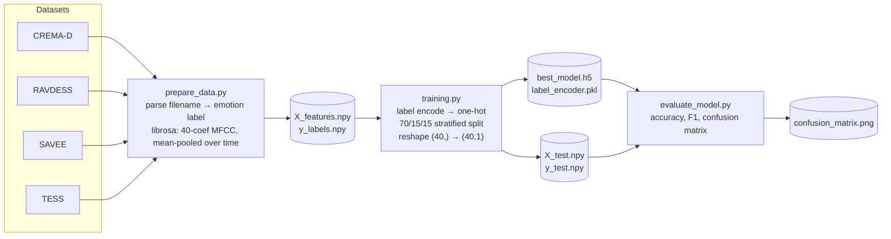
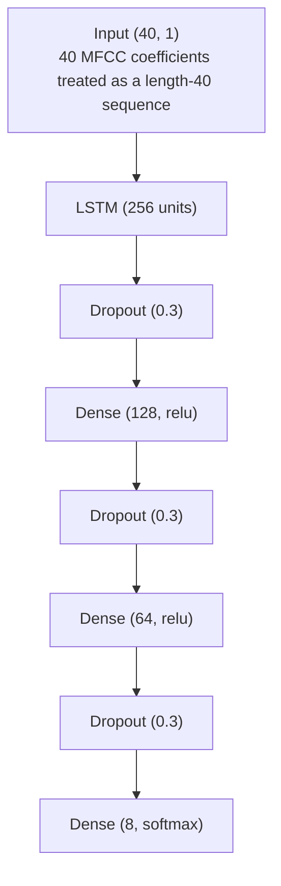
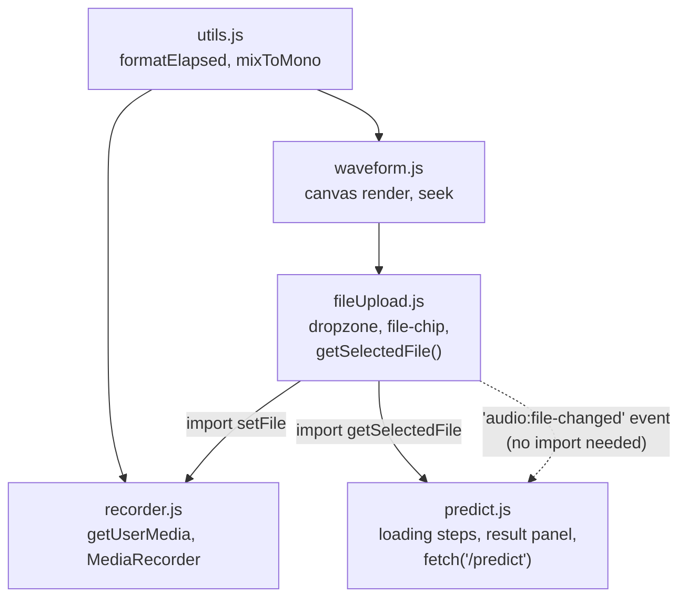

# Architecture & Data Flow

This document describes how the pieces of this repository fit together: the offline
pipeline that produces the trained model, and the runtime path that serves predictions
through the Flask app. For the non-technical objective/capabilities view, see
[FUNCTIONAL_SYNOPSIS.md](FUNCTIONAL_SYNOPSIS.md); for how the project reached this state,
see [PROJECT_EVOLUTION.md](PROJECT_EVOLUTION.md).

## Components

| File | Role | Notes |
|---|---|---|
| [`prepare_data.py`](prepare_data.py) | Builds the training dataset | Combines 4 public corpora, extracts MFCC features. Colab notebook (`.ipynb` content saved with a `.py` extension). |
| [`training.py`](training.py) | Trains the classifier | Loads the features saved by `prepare_data.py`, trains an LSTM, saves `best_model.h5`. Also a Colab notebook. |
| [`evaluate_model.py`](evaluate_model.py) | Offline evaluation | Loads the trained model + held-out test split, reports accuracy/F1, plots a confusion matrix. Colab notebook. |
| [`app.py`](app.py) | Flask web server | Loads the trained model once at startup; exposes `/` (UI) and `/predict` (inference API). |
| [`templates/index.html`](templates/index.html) | Browser UI (markup only) | Structure only — no inline CSS/JS. Loads 4 stylesheets and one `type="module"` script via `url_for('static', ...)`. |
| [`static/css/base.css`](static/css/base.css) | Styling — foundation | CSS variables (`:root`), dark-mode overrides via `prefers-color-scheme`, `body`/`.card`/header — shared by every other stylesheet. |
| [`static/css/upload.css`](static/css/upload.css) | Styling — file picker concern | Dropzone, record button (+ recording-state pulse), file chip. |
| [`static/css/player.css`](static/css/player.css) | Styling — waveform player concern | Play button, canvas sizing, time readout. |
| [`static/css/predict.css`](static/css/predict.css) | Styling — predict/result concern | Predict button, spinner, loading checklist, result panel + probability bars. |
| [`static/js/main.js`](static/js/main.js) | Composition root | Only imports the 4 feature modules below — no logic of its own. Native ES modules (`type="module"`) resolve the dependency order; listing order here doesn't matter. |
| [`static/js/utils.js`](static/js/utils.js) | Shared pure helpers | `formatElapsed()`, `mixToMono()` — no DOM access, no dependencies. |
| [`static/js/waveform.js`](static/js/waveform.js) | Waveform player concern | Canvas rendering, click-to-seek, playback-progress sync. Imports `utils.js` only. |
| [`static/js/fileUpload.js`](static/js/fileUpload.js) | File selection concern | Dropzone/drag-drop/file-chip/clear button. Owns `selectedFile` (exposed via `getSelectedFile()`), imports `waveform.js`, and announces changes via a `document`-level `'audio:file-changed'` CustomEvent rather than importing whoever needs to react. |
| [`static/js/recorder.js`](static/js/recorder.js) | Microphone recording concern | `getUserMedia`/`MediaRecorder` + WebM→WAV conversion. Imports `setFile` from `fileUpload.js` and `utils.js`. |
| [`static/js/predict.js`](static/js/predict.js) | Predict/result concern | Loading checklist, result panel + its fade/slide-in, the `fetch('/predict')` call. Imports `getSelectedFile` from `fileUpload.js`; reacts to `'audio:file-changed'` via the event listener instead of an import, so the dependency graph stays one-directional (no cycle between `fileUpload.js` and `predict.js`). |
| `best_model.h5` | Trained weights | Keras `.h5` checkpoint saved by `ModelCheckpoint` during training. |
| `label_encoder.pkl` | Class label mapping | `sklearn.LabelEncoder`, fit once during training, reused at inference to turn model output indices back into emotion names. |
| `X_features.npy` / `y_labels.npy` | Full extracted feature set | Output of `prepare_data.py`, input to `training.py`. |
| `X_test.npy` / `y_test.npy` | Held-out test split | Sliced off during `training.py`, consumed by `evaluate_model.py`. |
| `confusion_matrix.png` | Evaluation artifact | Generated by `evaluate_model.py`, embedded in `README.md`. |

## 1. Offline pipeline (run once, produces the model artifacts)



**Feature extraction detail** (identical logic appears in `prepare_data.py` and is duplicated
in `app.py`'s `extract_features()` — see Known Coupling below):

```python
y, sr = librosa.load(path, duration=3, offset=0.5)      # 3s window, skip first 0.5s
mfcc = np.mean(librosa.feature.mfcc(y=y, sr=sr, n_mfcc=40).T, axis=0)  # (40,) — time axis is pooled away
```

**Model architecture** (`training.py`):



All Dense/LSTM layers use L2 regularization (1e-4). Training uses `EarlyStopping`,
`ReduceLROnPlateau`, and `ModelCheckpoint(monitor='val_accuracy')` over up to 150 epochs.

## 2. Runtime / serving flow (what happens on every request)

```mermaid
sequenceDiagram
    participant U as Browser (index.html)
    participant F as Flask (app.py)
    participant M as Model + LabelEncoder

    Note over F,M: On process start (once)
    F->>M: load_model(best_model.h5)<br/>joblib.load(label_encoder.pkl)

    U->>F: GET /
    F-->>U: render_template(index.html)

    alt user uploads/drops a file
        U->>U: user selects/drops an audio file (.wav/.mp3/.ogg/.flac)
    else user records from microphone
        U->>U: getUserMedia() + MediaRecorder → WebM/Opus blob
        U->>U: decodeAudioData() + manual WAV re-encode (Web Audio API)<br/>keeps the app FFmpeg-free — backend only ever sees a WAV
    end
    U->>U: URL.createObjectURL() feeds a hidden &lt;audio&gt; element for playback<br/>(no request to F — purely client-side)
    U->>U: separately, decodeAudioData() extracts amplitude peaks<br/>→ rendered as a clickable canvas waveform, synced to playback position
    U->>F: POST /predict (multipart file "audio")
    F->>F: check extension against ALLOWED_EXTENSIONS<br/>400 + JSON error if unsupported
    F->>F: save upload to uploads/<filename>
    F->>F: extract_features(): librosa MFCC (same recipe as training)
    alt decode/inference succeeds
        F->>M: model.predict(features)
        M-->>F: softmax probabilities (8,)
        F->>F: argmax → label_encoder.inverse_transform
        F-->>U: 200 JSON {emotion, confidence, all_probabilities}
    else decode fails (corrupt file, unsupported codec variant)
        F-->>U: 400 JSON {error: "Could not process audio file: ..."}
    end
    F->>F: os.remove(filepath)  (temp file cleanup, always runs, in `finally`)
    U->>U: render emoji + confidence badge + sorted probability bars, or error hint
```

Key points about `app.py` as currently written:
- The model and label encoder are loaded **once at import time**, not per-request — this is
  why the very first request after starting the server is slow (TensorFlow warm-up) but
  subsequent ones are fast.
- **The predict-button loading sequence is simulated on the client, not driven by real
  backend progress.** `/predict` is one synchronous request/response with no streaming or
  progress endpoint, so the frontend cannot actually know which stage the server is in. The
  4-stage checklist (`Uploading → Extracting features → Running model → Finalizing`) advances
  on fixed client-side timers tuned to look natural for a typical fast request, and the final
  stage simply holds (still animating, not frozen) for however long the real response
  actually takes — including the ~30s first-call warm-up case. If a real progress API is ever
  added server-side, this is the piece that would need replacing with genuine progress events.
- **The loading→result handoff is explicitly sequenced, not two independent toggles.**
  `stopLoadingStages(success, onHidden)` holds the completed checklist briefly, fades it out
  (CSS opacity transition), and only *then* invokes `onHidden` — which populates and reveals
  the result panel (`renderResult()` + `showResult()`), itself a fade/slide-in rather than an
  instant `display` swap. The Predict button stays disabled for the whole handoff (re-enabled
  inside the same callback), so a second click can't land mid-transition and overlap the two
  panels' states. `showResult()` uses the standard force-reflow-then-`requestAnimationFrame`
  technique (`display:block` → read `offsetWidth` → add the `.visible` class next frame) since
  a CSS transition cannot animate across a `display:none` boundary in one step.
- Each upload is written to disk (`uploads/`) and deleted immediately after inference
  (`finally: os.remove(filepath)`), so nothing persists between requests.
- The Flask dev server runs with `debug=True, use_reloader=False` (the reloader was disabled
  on this branch — it was spawning orphaned processes that never shut down cleanly on Windows).
- **Supported upload formats: WAV, MP3, OGG, FLAC** — enforced server-side via an
  `ALLOWED_EXTENSIONS` allow-list in `app.py` (previously the `.wav`-only restriction existed
  only as a client-side file-picker hint with zero backend enforcement). All four formats are
  decoded by `soundfile`/`libsndfile` directly — **no FFmpeg dependency**. This was verified
  empirically (write → `librosa.load` → MFCC round-trip) against the exact `soundfile`
  version pinned in `requirements.txt`, not assumed from general library docs.
  M4A/AAC is deliberately out of scope: `libsndfile` doesn't support that container, and the
  `audioread` fallback has no working backend without an FFmpeg install on the host — adding
  it later means introducing FFmpeg as a system-level (non-pip) dependency.
- **Decode failures are now caught explicitly.** `/predict` previously had a bare
  `try/finally` with no `except` — any decode error (corrupt file, truncated upload) surfaced
  as an uncaught 500 with a raw traceback. It now returns a clean `400` with a JSON
  `{"error": ...}` message the frontend already knows how to render. One caveat: some
  exceptions (e.g. `audioread.exceptions.NoBackendError`) have an empty `str()`, so the
  handler falls back to the exception class name when the message itself is blank.
- **Microphone recording is entirely client-side, no server changes.** `MediaRecorder`
  captures audio as WebM/Opus (or whatever the browser defaults to), which `libsndfile`
  cannot decode and which would otherwise require FFmpeg — the same gap identified for
  M4A/AAC. Instead, `static/js/main.js` decodes the recorded blob via
  `AudioContext.decodeAudioData()` and manually re-encodes a standard 44-byte-header PCM WAV
  in-browser (`audioBufferToWavBlob()`), so the backend receives an ordinary WAV upload and
  needs no awareness that the source was a live recording. Verified end-to-end by substituting
  a synthetic `MediaStreamDestination` tone for `getUserMedia()` (the actual OS mic-permission
  dialog can't be automated in a test harness) and confirming the resulting WAV round-trips
  through `/predict` correctly.
- **Recording requires a secure context.** `getUserMedia` only works over HTTPS or on
  `localhost` — this works today because the dev server is `127.0.0.1`, but will need HTTPS
  once deployed (relevant for the eventual Hugging Face Spaces/Render deployment).
- A hard cap (`MAX_RECORD_SECONDS = 60`) auto-stops any recording left running. Note the
  model itself only ever reads the first 3 seconds of whatever clip it receives regardless of
  length, so anything recorded beyond that is captured but has no effect on the prediction.
- **Waveform rendering is a separate, independent decode from playback.** The visible
  `<canvas>` waveform is generated by decoding the selected/recorded file a second time via
  `AudioContext.decodeAudioData()` purely to extract ~120 amplitude peaks (`computePeaks()`);
  actual playback still goes through the hidden native `<audio>` element, which has its own
  independent decoder. This is deliberate: if peak-extraction ever fails for some edge-case
  file, it fails silently (`console.warn`, caught) and playback itself is unaffected — the
  waveform is additive/decorative, never a dependency for the app's core function. Progress
  highlighting (played vs. unplayed bars) and click-to-seek both read/write `audioPreview
  .currentTime` directly, so the canvas and the underlying `<audio>` element stay in sync.

## 3. Frontend module structure (separation of concerns)

Each JS/CSS file now maps to exactly one UI concern, rather than one large `main.js` +
`style.css` holding everything. The dependency graph is deliberately kept **one-directional**
(no cycles):



The one deliberate design choice worth calling out: `fileUpload.js` and `predict.js` both need
to react to each other conceptually (a new file should hide the old result; predicting needs
to know the current file) — but rather than a circular import between them, `predict.js`
imports `getSelectedFile()` from `fileUpload.js` (one direction), and `fileUpload.js`
communicates the "a file changed" fact via a `document.dispatchEvent(new CustomEvent(
'audio:file-changed'))` that `predict.js` merely listens for. `fileUpload.js` never needs to
import `predict.js` at all, so the graph has no cycle.

`static/js/main.js` is a thin composition root (`import './waveform.js'; import
'./fileUpload.js'; ...` — four lines, no logic) — `templates/index.html` only needs one
`<script type="module" src="...main.js">` tag; native ES module resolution handles loading
the rest in the correct dependency order regardless of the order they're listed in.

CSS mirrors the same boundaries (`base.css` → `upload.css` / `player.css` / `predict.css`),
loaded as four `<link>` tags rather than one stylesheet.

## Known coupling / fragility (relevant before touching the ML side)

- **Feature-extraction code is duplicated.** The MFCC recipe in `app.py::extract_features()`
  must stay byte-for-byte consistent with the one in `prepare_data.py` — there's no shared
  module. If one changes without the other, inference silently produces garbage (wrong
  feature distribution, no error thrown).
- **Mean-pooling collapses time before the LSTM sees it.** The model input shape `(40, 1)` is
  a single 40-value vector reshaped to look sequence-like — the LSTM never actually sees
  frame-level temporal structure. This is a real architectural limitation, not just a style
  choice (relevant for the improvement discussion).
- **No shared config for feature parameters.** `n_mfcc=40`, `duration=3`, `offset=0.5` are
  hardcoded independently in two files rather than defined once.
- **No model versioning.** `best_model.h5` is a single checkpoint with no record of which
  training run / hyperparameters produced it.

## Tech stack

| Layer | Choice |
|---|---|
| Feature extraction | Librosa (MFCC) |
| Model | TensorFlow / Keras (LSTM) |
| Serving | Flask (dev server) |
| Frontend | Vanilla HTML/CSS/JS, no build step — native ES modules (`type="module"`) split by concern across `static/js/`, matching CSS split across `static/css/`, served via Flask's default static-folder convention. No bundler, no transpiler; the browser's own module resolution handles the dependency graph. |
| Persistence | `.h5` (model), `.pkl` (label encoder), `.npy` (feature arrays) |
