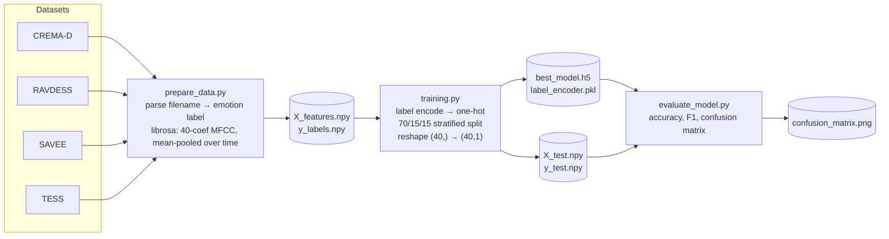
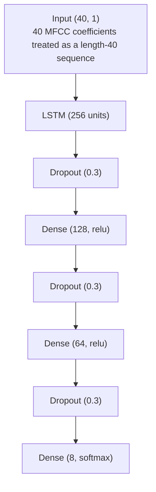
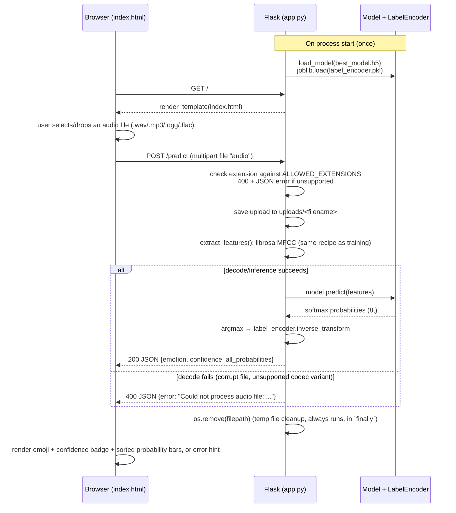

# Architecture & Data Flow

This document describes how the pieces of this repository fit together: the offline
pipeline that produces the trained model, and the runtime path that serves predictions
through the Flask app.

## Components

| File | Role | Notes |
|---|---|---|
| [`prepare_data.py`](prepare_data.py) | Builds the training dataset | Combines 4 public corpora, extracts MFCC features. Colab notebook (`.ipynb` content saved with a `.py` extension). |
| [`training.py`](training.py) | Trains the classifier | Loads the features saved by `prepare_data.py`, trains an LSTM, saves `best_model.h5`. Also a Colab notebook. |
| [`evaluate_model.py`](evaluate_model.py) | Offline evaluation | Loads the trained model + held-out test split, reports accuracy/F1, plots a confusion matrix. Colab notebook. |
| [`app.py`](app.py) | Flask web server | Loads the trained model once at startup; exposes `/` (UI) and `/predict` (inference API). |
| [`templates/index.html`](templates/index.html) | Browser UI (markup only) | Structure only — no inline CSS/JS. Pulls in the two files below via `url_for('static', ...)`. |
| [`static/css/style.css`](static/css/style.css) | Styling | All presentation (layout, color, dark-mode via `prefers-color-scheme`, animations). |
| [`static/js/main.js`](static/js/main.js) | Client behavior | Drag-and-drop handling, `fetch('/predict')`, rendering the result panel and probability bars. |
| `best_model.h5` | Trained weights | Keras `.h5` checkpoint saved by `ModelCheckpoint` during training. |
| `label_encoder.pkl` | Class label mapping | `sklearn.LabelEncoder`, fit once during training, reused at inference to turn model output indices back into emotion names. |
| `X_features.npy` / `y_labels.npy` | Full extracted feature set | Output of `prepare_data.py`, input to `training.py`. |
| `X_test.npy` / `y_test.npy` | Held-out test split | Sliced off during `training.py`, consumed by `evaluate_model.py`. |
| `confusion_matrix.png` | Evaluation artifact | Generated by `evaluate_model.py`, embedded in `README.md`. |

## 1. Offline pipeline (run once, produces the model artifacts)



**Feature extraction detail** (identical logic appears in `prepare_data.py` and is duplicated
in `app.py`'s `extract_features()` — see Known Coupling below):

```python
y, sr = librosa.load(path, duration=3, offset=0.5)      # 3s window, skip first 0.5s
mfcc = np.mean(librosa.feature.mfcc(y=y, sr=sr, n_mfcc=40).T, axis=0)  # (40,) — time axis is pooled away
```

**Model architecture** (`training.py`):



All Dense/LSTM layers use L2 regularization (1e-4). Training uses `EarlyStopping`,
`ReduceLROnPlateau`, and `ModelCheckpoint(monitor='val_accuracy')` over up to 150 epochs.

## 2. Runtime / serving flow (what happens on every request)



Key points about `app.py` as currently written:
- The model and label encoder are loaded **once at import time**, not per-request — this is
  why the very first request after starting the server is slow (TensorFlow warm-up) but
  subsequent ones are fast.
- Each upload is written to disk (`uploads/`) and deleted immediately after inference
  (`finally: os.remove(filepath)`), so nothing persists between requests.
- The Flask dev server runs with `debug=True, use_reloader=False` (the reloader was disabled
  on this branch — it was spawning orphaned processes that never shut down cleanly on Windows).
- **Supported upload formats: WAV, MP3, OGG, FLAC** — enforced server-side via an
  `ALLOWED_EXTENSIONS` allow-list in `app.py` (previously the `.wav`-only restriction existed
  only as a client-side file-picker hint with zero backend enforcement). All four formats are
  decoded by `soundfile`/`libsndfile` directly — **no FFmpeg dependency**. This was verified
  empirically (write → `librosa.load` → MFCC round-trip) against the exact `soundfile`
  version pinned in `requirements.txt`, not assumed from general library docs.
  M4A/AAC is deliberately out of scope: `libsndfile` doesn't support that container, and the
  `audioread` fallback has no working backend without an FFmpeg install on the host — adding
  it later means introducing FFmpeg as a system-level (non-pip) dependency.
- **Decode failures are now caught explicitly.** `/predict` previously had a bare
  `try/finally` with no `except` — any decode error (corrupt file, truncated upload) surfaced
  as an uncaught 500 with a raw traceback. It now returns a clean `400` with a JSON
  `{"error": ...}` message the frontend already knows how to render. One caveat: some
  exceptions (e.g. `audioread.exceptions.NoBackendError`) have an empty `str()`, so the
  handler falls back to the exception class name when the message itself is blank.

## Known coupling / fragility (relevant before touching the ML side)

- **Feature-extraction code is duplicated.** The MFCC recipe in `app.py::extract_features()`
  must stay byte-for-byte consistent with the one in `prepare_data.py` — there's no shared
  module. If one changes without the other, inference silently produces garbage (wrong
  feature distribution, no error thrown).
- **Mean-pooling collapses time before the LSTM sees it.** The model input shape `(40, 1)` is
  a single 40-value vector reshaped to look sequence-like — the LSTM never actually sees
  frame-level temporal structure. This is a real architectural limitation, not just a style
  choice (relevant for the improvement discussion).
- **No shared config for feature parameters.** `n_mfcc=40`, `duration=3`, `offset=0.5` are
  hardcoded independently in two files rather than defined once.
- **No model versioning.** `best_model.h5` is a single checkpoint with no record of which
  training run / hyperparameters produced it.

## Tech stack

| Layer | Choice |
|---|---|
| Feature extraction | Librosa (MFCC) |
| Model | TensorFlow / Keras (LSTM) |
| Serving | Flask (dev server) |
| Frontend | Vanilla HTML/CSS/JS, no build step — served as separate files (`templates/` for markup, `static/css`+`static/js` for styling/behavior) via Flask's default static-folder convention, no bundler needed |
| Persistence | `.h5` (model), `.pkl` (label encoder), `.npy` (feature arrays) |
