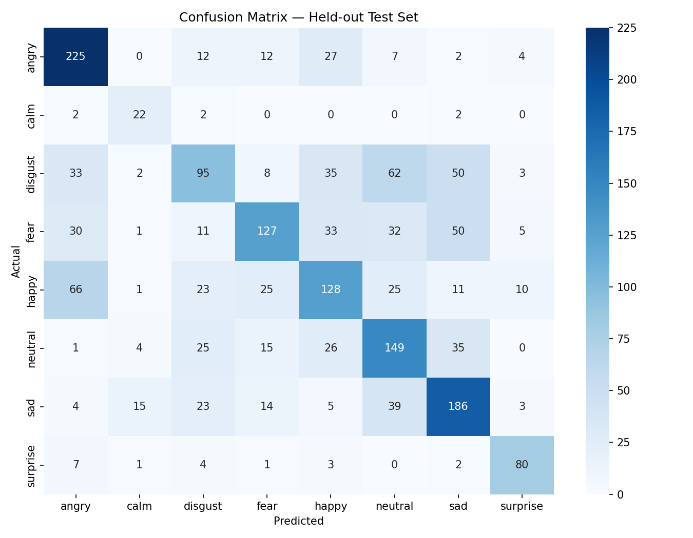

# 🎙️ Speech Emotion Recognition using LSTM and MFCC
A Speech Emotion Recognition (SER) system that classifies human emotions from speech audio using **MFCC (Mel-Frequency Cepstral Coefficients)** and a **Long Short-Term Memory (LSTM)** neural network. The model is trained on multiple public speech emotion datasets and deployed using a Flask web application.

---

## 📌 Project Overview

Speech Emotion Recognition is a machine learning task that identifies emotions from spoken audio. This project extracts MFCC features from speech recordings and uses an LSTM-based neural network to classify emotions.
## 📊 Key Results

- ✅ Test Accuracy: **55.45%**
- ✅ Weighted F1 Score: **0.545**
- ✅ Trained on **12,000+** speech samples
- ✅ Combined **4 public datasets**
- ✅ Flask web application for real-time prediction
### Supported Emotions

- 😠 Angry
- 😄 Happy
- 😢 Sad
- 😐 Neutral
- 😨 Fear
- 🤢 Disgust
- 😌 Calm
- 😲 Surprise

---

# 🚀 Features

- Trained on four public speech emotion datasets
- MFCC feature extraction using Librosa
- LSTM Deep Learning model using TensorFlow/Keras
- Flask web application for emotion prediction
- Confusion Matrix visualization
- Model evaluation with Accuracy and Weighted F1-Score
- Label Encoder for emotion mapping

---

# 📂 Dataset

The model is trained on the following publicly available datasets:

- CREMA-D
- RAVDESS
- SAVEE
- TESS

Approximately **12,000+ audio samples** were combined to improve model generalization.

---

# 🧠 Model Architecture

Input Audio (.wav)

↓

MFCC Feature Extraction (40 coefficients)

↓

LSTM (256 Units)

↓

Dropout (0.3)

↓

Dense (128)

↓

Dropout (0.3)

↓

Dense (64)

↓

Dropout (0.3)

↓

Softmax Output Layer

---

# 📊 Results

| Metric | Value |
|---------|-------|
| Test Accuracy | **55.45%** |
| Weighted F1 Score | **0.545** |
| Number of Classes | 8 |

The model performs approximately **4× better than random guessing** for multi-class speech emotion recognition.

---

# 📈 Confusion Matrix



---

# 🛠️ Technologies Used

- Python
- TensorFlow
- Keras
- Librosa
- NumPy
- Pandas
- Scikit-learn
- Matplotlib
- Flask

---

# 📁 Project Structure

```
Speech-Emotion-Recognition/
│
├── app.py
├── training.py
├── prepare_data.py
├── evaluate_model.py
├── best_model.h5
├── label_encoder.pkl
├── X_features.npy
├── X_test.npy
├── y_labels.npy
├── y_test.npy
├── confusion_matrix.png
├── requirements.txt
└── README.md
```

---

# ⚙️ Installation

Clone the repository

```bash
git clone https://github.com/SandeepKumar8696/speech-emotion-recognition.git
```

Go to the project folder

```bash
cd speech-emotion-recognition
```

Install dependencies

```bash
pip install -r requirements.txt
```

---

# ▶️ Train the Model

```bash
python training.py
```

---

# 📊 Evaluate the Model

```bash
python evaluate_model.py
```

---

# 🌐 Run the Flask Application

```bash
python app.py
```

Open your browser and visit:

```
http://127.0.0.1:5000
```

Upload a `.wav` file to predict the emotion.

---

# 🔮 Future Improvements

- Use Mel Spectrograms instead of mean-pooled MFCC
- CNN + BiLSTM architecture
- Transformer / wav2vec2 embeddings
- Real-time microphone emotion recognition
- Deploy using Hugging Face Spaces or Render

---

# 📚 Learning Outcomes

Through this project I learned:

- Audio preprocessing
- Feature extraction using MFCC
- Deep Learning with LSTM
- Model evaluation techniques
- Flask deployment
- Speech signal processing
- End-to-end machine learning workflow

---

# 👨‍💻 Author

**Sandeep Kumar**

B.Tech – Artificial Intelligence & Data Science

GitHub:
https://github.com/SandeepKumar8696

LinkedIn:
(Add your LinkedIn profile here)

---

## ⭐ If you found this project useful, consider giving it a star!
